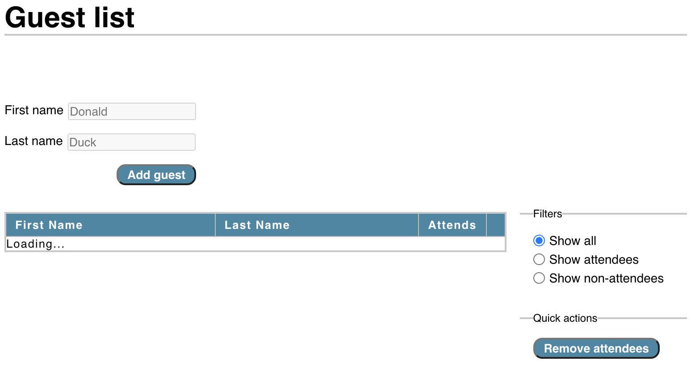
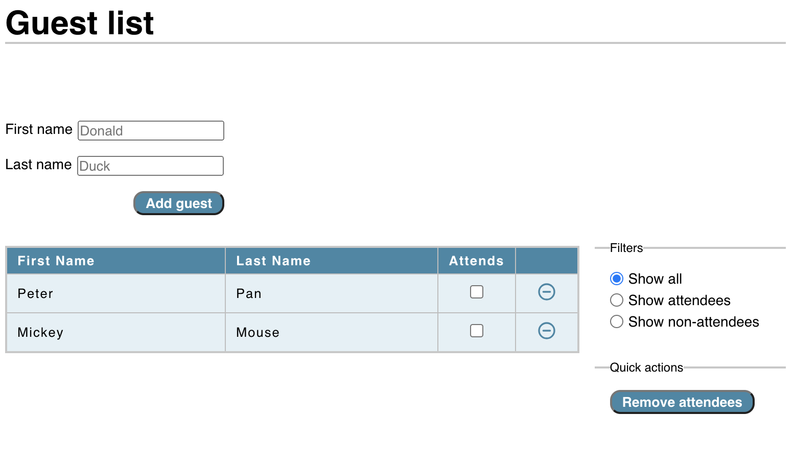

# Simple react guest list app

This react meme generator was created as part of the UpLeveled GmbH coding boot camp. You can open the deployed app here: https://main--bucolic-semifreddo-d30746.netlify.app/

<table>
  <tr>
    <td></td>
    <td></td>
  </tr>
</table>

## Core features

- Create a new guest
  - by hitting the "ENTER" key in the "last name" input field.
  - by using the "Create guest" button.
- View all guests in a clean table format.
- Mark guests as attendees by checking the checkbox.
- Undo marking guests as attendees by unchecking the checkbox.
- Remove guests individually by clicking the delete icon.

## Additional core features

- Remove all attendees in bulk by clicking the "Remove attendees" button.
- Filter the guest list table view
  - by clicking the "show attendees" radio button.
  - by clicking the "show non-attendees" radio button.
  - by clicking the "show all" radio button.

## Additional nice-to-have features

- The next input field is focussed after hitting the "ENTER" key by using a useRef hook.
- The cursor becomes a pointer upon hovering over buttons, radios and checkboxes.
- Filters are using radio buttons to improve the UX. "Show all" is checked by default.
- The conditional rendering only starts below the table headers to improve the UX.
